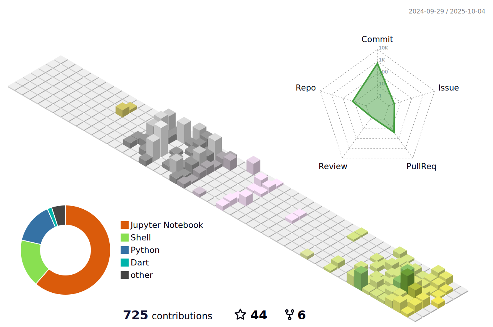

#  Hi there, I'm @tsiendragon! :wave:

  

## About Me :robot:

  <picture>
    <source media="(prefers-color-scheme: dark)" srcset="https://raw.githubusercontent.com/tsiendragon/tsiendragon/output/github-contribution-grid-snake-dark.svg">
    <source media="(prefers-color-scheme: light)" srcset="https://raw.githubusercontent.com/tsiendragon/tsiendragon/output/github-contribution-grid-snake.svg">
    
  </picture>

I'm a passionate developer and researcher with a keen interest in Artificial Intelligence and Generative AI. Currently exploring the fascinating world of AIGC, where creativity meets technology! Let's innovate together! 🚀

  

## Tech Stack :hammer_and_wrench:

  
  
  
  
  

## Featured Projects :bulb:

  
  

### Other Projects
- 📚 [NUS PhD Thesis LaTeX Template](https://github.com/tsiendragon/NUS-PhD-Thesis-LaTeX-Template): A comprehensive LaTeX template for NUS PhD theses.
- 🔬 [Separability](https://github.com/tsiendragon/Separability): Explore quantum state separability. (Archive)
- 📖 [TA](https://github.com/tsiendragon/TA): Teaching Assistant resources and tools. (Archive)

## Research Publications :books:

Click to expand

- 📄 [Separability of completely symmetric states in a multipartite system](https://scholar.google.com/citations?view_op=view_citation&hl=zh-CN&oe=GB&user=krc-mOgAAAAJ&citation_for_view=krc-mOgAAAAJ:zYLM7Y9cAGgC)
- 📄 [A matrix inequality for entanglement distillation problem](https://scholar.google.com/citations?view_op=view_citation&hl=zh-CN&oe=GB&user=krc-mOgAAAAJ&citation_for_view=krc-mOgAAAAJ:d1gkVwhDpl0C)
- 📄 [Separability of multipartite quantum states with strong positive partial transpose](https://scholar.google.com/citations?view_op=view_citation&hl=zh-CN&oe=GB&user=krc-mOgAAAAJ&citation_for_view=krc-mOgAAAAJ:UeHWp8X0CEIC)
- 📄 [A Study on Quantum Entanglement](https://scholar.google.com/citations?view_op=view_citation&hl=zh-CN&oe=GB&user=krc-mOgAAAAJ&citation_for_view=krc-mOgAAAAJ:qjMakFHDy7sC)

## Latest Blog Posts :mega::newspaper:

  <a href="https://mad-sg.github.io/generative-ai-start-to-surrender/"><b>🎯 Generative AI: Start to Surrender</b></a> 
  <i>An exploration of the latest trends in generative AI that you won't want to miss!</i>
    
  <a href="https://tsiendragon.github.io/learning/index.html"><b>📚 My Learning Journey</b></a> 
  <i>Join me as I share insights and experiences from my continuous learning path!</i>

## GitHub Activity

  

  

  

